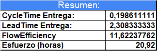
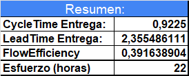
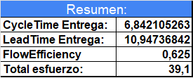

# Informe de Obligatorio ISA

---------------------------------------------------------------------------

## Materia: INGENIERIA DE SOFTWARE AGIL 2

### Equipo 5 - Mini proyecto

- Sebastian Silveira (242951)
- Giuliano Rossito (256201)
- Ana Laura Montes de Oca (146669)
---------------------------------------------------------------------------

### Herramienta para gestión del proyecto

#### GITHUB: 

### Versionado

#### Repositorio Github: <https://github.com/IngSoft-ISA2-2023-2/obligatorio-montes-de-oca-rositto-silvera>

---------------------------------------------------------------------------

## Indice
### Entrega 1
1. [Definición del marco de trabajo](#definición-del-marco-de-trabajo)

2. [Marco general de trabajo KANBAN](#marco-general-de-trabajo-kanban)

3. [Roles](#roles)

4. [Políticas de trabajo](#políticas-de-trabajo)   

    a. [Definición de Ready](#definición-de-ready)

    b. [Definición de Done](#definición-de-done)

5. [Control de versiones](#control-de-versiones)
    
    a. [Nombre de ramas, commits y PRs](#nombre-de-ramas-commits-y-prs)

6. [ISSUES - ANÁLISIS DE DEUDA TÉCNICA](#issues---análisis-de-deuda-técnica)

7. [Retrospectiva](#retrospectiva)

8. [Estimaciones de Esfuerzo y Registro de tareas](#Estimaciones-de-Esfuerzo-y-Registro-de-tareas)

### [Entrega 2](#entrega-2-1)

1. [Definición del Marco de Trabajo](#definición-del-marco-de-trabajo-1)

2. [Cambios Tablero KANBAN](#cambios-tablero-kanban)

3. [Cambios en el control de Versiones](#cambios-en-el-control-de-versiones)

4. [Pipeline y Automatización](#pipeline-y-automatizacion)

5. [Correcciones de Issues](#correcciones-de-issues)

6. [Explicación del tablero y su vínculo con el proceso de ingeniería](#explicación-del-tablero-y-su-vínculo-con-el-proceso-de-ingeniería)

7. [Retrospectiva](#retrospectiva-1)

8. [Nuevos Issues](#nuevos-issues)

### [Entrega 3](#entrega-3-1)

1. [Definición del Marco de Trabajo](#definición-del-marco-de-trabajo-2)

2. [Cambios Tablero KANBAN](#cambios-tablero-kanban-1)

3. [Cambios en el control de Versiones](#cambios-en-el-control-de-versiones-1)

4. [Pipeline y Automatización](#pipeline-y-automatización)

5. [Correcciones de Issues](#correcciones-de-issues-1)

6. [Explicación del tablero y su vínculo con el proceso de ingeniería](#explicación-del-tablero-y-su-vínculo-con-el-proceso-de-ingeniería-1)

7. [Retrospectiva](#retrospectiva-2)

8. [Nuevos Issues](#nuevos-issues-1)

### [Entrega 4](#entrega-4-1)

1. [Definición del Marco de Trabajo](#definición-del-marco-de-trabajo-3)

2. [Cambios Tablero KANBAN](#cambios-tablero-kanban-2)

3. [Cambios en el control de Versiones](#cambios-en-el-control-de-versiones-2)

4. [Pipeline y Automatización](#pipeline-y-automatización)

5. [Correcciones de Issues](#correcciones-de-issues-2)

6. [Explicación del tablero y su vínculo con el proceso de ingeniería](#explicación-del-tablero-y-su-vínculo-con-el-proceso-de-ingeniería-2)

7. [Reviews](#reviews)

8. [Retrospectiva](#retrospectiva-2)

9. [Métricas](#métricas)

10. [Selenium](#selenium)

## [Definición del marco de trabajo](#indice)

### [Marco general de trabajo KANBAN](#indice)

El resultado del proyecto es poder mejorar y ofrecerle mantenimiento a una aplicacion ya desarrollada por otro equipo con el objetivo de incrementar el valor que se entrega a los usuarios.

Dicho marco de trabajo es desconocido para los integrantes del equipo por lo que va a haber una cierta curva de aprendizaje dentro del desarrollo de la aplicación.

El equipo de desarrollo va a utilizar la forma de trabajo basada en Kanban y además optamos por seguir un ciclo de vida incremental del producto.

**Definición y uso del proceso de Ingeniería en proceso Kanban**

La Ingeniería de Requerimientos corresponde a un proceso sistemático para el descubrimiento, desarrollo, trazabilidad, análisis, clasificación, comunicación y Gestión de Requerimientos, el cual define un sistema en niveles sucesivos de abstracción. Dicho proceso busca fundamentalmente facilitar las tareas que soporten los demás procesos de negocio al interior de una organización, y como todo proceso, sirve de entrada y salida para muchos otros.

Este proceso, que hemos aprendido a lo largo de varios cursos en la carrera y además tiene sus beneficios y sus desventajas. Muchas y variadas empresas han encontrado una brecha bastante amplia entre lo relevado, tan específico y detallado, que además se realiza en el marco de una metodología en cascada, es un proceso lento, costoso y que no favorece la entrega del producto final. 

Las metodologías ágiles han venido para tratar de acortar esta brecha, bajando la intensidad de estas etapas, utilizando artefactos, cremonias y herramientas visuales que favorecen la calidad, la mejora contínua, la flexibilidad, la reducción del desperdicio, entre otros.

En particular Kanban es una metodología de gestión visual que se utiliza comúnmente en entornos de trabajo para mejorar la eficiencia y la productividad. Su objetivo principal es optimizar el flujo de trabajo y la entrega de productos o servicios al eliminar el exceso de trabajo en proceso y minimizar los cuellos de botella.

¿Cómo se mapea esta Ingeniería de requerimientos con nuestra metodología Kanban?

El proceso de Ingeniería de requerimientos, se mapea a un proceso muy simple de Planning, dentro del proceso completo Planning-Do-Check, donde las tares de Planificación se corresponden a entrevistas con el cliente donde se describen sus necesidades que luego son transformadas en requerimientos de software. 
Es importante en esta etapa identificar las necesidades propias del cliente, así como requerimientos de entorno o potenciales cambios que puedan delimitar nuestro escenario de implantación. 

Esta etapa fue lograda en nuestro proyecto a través de la lectura del Obligatorio (la rúbrica), los requerimientos que fueron explicando los profesores y de alguna forma 'desmenuzando' estas necesidades en tareas. 

 Seguidamente este listado de necesidades identificadas es transformado a requerimientos, en general redactados como User Storys, en nuestro caso, aún no contamos con user story si no solo con tareas. 
 Estas tareas deben ser redactadas de forma clara y precisa evitando ambigüedades. La lista con los requerimientos obtenidos, es priorizada, categorizada teniendo en cuenta cada una de las tareas propuestas, las cuales conforman el producto de trabajo comúnmente conocido como Product Backlog.
 
 Estos requerimientos forman parte del TODO: para hacer, que luego se van moviendo a una o varias columnas que conforman un artefacto visual: El tablero Kanban, donde luego de finalizadas y si cumple los criterios de aceptación se mueven al DONE.

 Este proceso de mover las tareas entre las diferentes columnas del Tablero, cumple con el Check, Control y Seguimiento pudiendo visualizar last tareas pendientes, en desarrollo y realizadas. Además permite agregar múltiples atributos que luego explicaremos en detalle.

 **Cómo adaptamos los 6 principios Kanban a nuestro marco de trabajo:**
 
 **1) Visualizar el flujo de trabajo:**
 Dentro de nuestro repositorio creamos un proyecto de nombre Entrega 1 donde iremos gestionando nuestras diferentes entregas. Estas entregas, así como en estas utilizaremos tableros dinámicos, que se podrán ir modificando en la medida que el proyecto así lo requiera. Está visible para todos los integrantes del equipo y cada uno puede gestionarlo a medida que avanza. 

**2) Limitar el WIP:**
 Limitamos el trabajo en curso para evitar cuellos de botella y para garantizar que solo entran elementos nuevos cuando hay capacidad de completarlos (no se produce por encima del cuello de botella).
 Esto lo logramos evitando que cada uno trabaje en 2 tareas/issues a la vez.

**3) Gestionar y medir el flujo:**
Mmedir para ver si se mejora o no y decidir en consecuencia. Podría ser número de tareas completas en el Sprint, o número de Story Points completados, el Lead Time, el Cycle Time, etc..

Como en esta Etapa tendremos básicamente tareas de diferentes titpo, hemos decidido medir con la unidad de esfuerzo: horas/hombre y no user stories. 
Primero porque no tenemos US y luego porque si medimos en días hay tareas que no llevan un día, si no horas. Es una unidad que nos permite medir unidades más pequeñas.

**4) Implementar ciclos de feedback:**
Son muy importantes y de mucho aprendizaje las retrospectivas y las stand ups. Hemos tenido dificultades para encontrar momentos en común, como lo dejamos reflejado en las retrospectiva, igualmente vamos a intentar mejorar para próximas entregas.  
son los standups y retrospectivas. Se debe recibir el feedback en todos los niveles (equipo, cliente, PO, etc.).

**5) Explicitar políticas y procedimientos:**
Por ejemplo los “Definition of Done”, “Definition of Ready”, valores y principios.
Esto lo vemos en la sección del capítulo que de Políticas, Definition of Donde y Definition of Ready.

**6) Mejora continua mediante la colaboración:**
Usar modelos y experimentar científicamente: definir una hipótesis, implementar un experimento y medir las consecuencias. Si funciona se sigue y si no comienzas de nuevo el ciclo.

Esta sección la comenzamos a experimentar con los commits de trunk-based. No conocíamos la técnica, la experimentamos y de ahora en más es la que vamos a utilizar o al menos hasta que surja otra que se recomiende en el curso.
Seguro encontraremos otras instancias para este apredizaje experimental. 

Tablero Kanban

Respecto al tablero:

Para esta iteracion se promueve la utilizacion de un
Tablero Kanban Ágile Simple:

Optamos por esta ocpión de Tablero y no la sustentable, ya que entendemos que las tareas tienen diferentes niveles de desarrollo, algunas pasan por análisis y desarrollo, otras simplemente por ser realizadas como calcular el esfuerzo o las métricas o un informe que requiere lectura previa y reflexiones.

Todas los tipos de tareas se pueden mover a un estado: DOING, donde indicamos que se está desarrollando esa tarea.

    Columna 1: Por Hacer (To Do): En esta columna, se enumeran todas las tareas o elementos de trabajo que aún no han comenzado. Representa las tareas pendientes que deben abordarse.
    En esta etapa de entrega se encuentran tareas propias de planificaicón y diseño del Tablero, análisis y preparación de materiales, así como las propias tareas de testing exploratorio propuestas en el proyecto. 

    Al principio habíamos desglosado en tareas por Roles del proyecto como Admin, dueño, Farmacia, Anonimo, nos pareció que quedaban muy abiertas y muy genéricas y no nos iban a permitir calcular buenas métricas, o al menos más detalladas, ya que un Rol puede tener varias funcionalidades. 
    Luego, fuimos discriminando por Rol - Funcionalidad ya que de esta manera quedaba encapsulada, en lo que luego podría ser una user stroy, para estimar, calcular tiempos de esfuezo, nos resultó más simple. 
    
    
    Columna 2: En Progreso (In Progress - DOING): Las tareas que están en proceso se mueven a esta columna. Aquí, los miembros del equipo trabajan activamente en estas tareas. El objetivo es limitar la cantidad de tareas en esta columna para evitar la sobrecarga. Y limitar el numero WIP.
    Al moverlas se coloca fecha - hora de comienzo y a quien se le asigna. 

    En nuestro caso en particualr, cada integrante del equipo trabajó en las tareas que fue tomando, agregando fecha y hora de comienzo así como fecha y hora de fin cuando las movía a la columna DONE.
    Se limita la cantidad de tarjetas que pueden estar en la columna "En Progreso" para evitar la congestión y fomentar la finalización de tareas antes de agregar nuevas. Es decir limitar el WIP.
    Cada desarrollador debe realizar de a una tarea a la vez.

    
    Columna 3: Completado (Done): Cuando una tarea se ha finalizado o completado, se traslada a esta columna. Aquí, se muestra claramente qué tareas se han terminado y están listas para su revisión o entrega. Al moverla a DONE se agrega fecha y hora de finalización

    Columna 4:
    Al ir avanzando en el aprendizaje de la herramienta y metodología vimos que creamos tareas que estaban repetidas, o que habían sido desglosadas en otras más pequeñas o que simplemente las habíamos porpuesto pero en realidad no llegamos con los tiempos, para este caso creamos la columna DEPRECADOS. 

    Conceptualmente se deberían defiir límites de WIP: En cada columna se establece un límite de cuántas tarjetas pueden estar en esa etapa al mismo tiempo. Esto evita la congestión y garantiza un flujo de trabajo constante.

    En particular,  en nuestro equipo limitamos la cantidad de tareas  a la vez, que cada miembro puede trabajar.

### [Roles](#indice)

En principio y por requerimiento de la letra del obligatorio, todos los integrantes del equipo somos desarrolladores y testers.
Aunque en la metodlogía KANBAN no tenemos la figura del SCRUM MASTER como obligatoria, vemos imprescindible en esta transición este rol, para ayudarnos a gestionar el tablero, indicar los atributos que tenía que tener cada tarjeta, así como promover las stand up.

Product Owner (PO): en esta etapa de aprendizaje y transición creemos conveniente que los 3 integrantes seamos PO, para llegar a entender con mayor exactitud y claridad los requerimientos y necesidades de los clientes, sobre todo de las prioridades y severidades. 
Los 3 podemos asignar prioridades y severidades así como opinar y solicitar cambio de alguna tarea que fue asignada a otro integrante del equipo.
Entendemos que esto es importante para fortalecer el equipo y tener una escucha activa y efectiva ante las necesidades. 

### [Políticas de trabajo](#indice)

Tuvimos muchas dificultades al comienzo del Obligatorio para entrar en 'ritmo', nos costó organizarnos, encontrar espacios en común para las Stand Up y la planificación. Se visualiza en las retrospectiva el reflejo de esta mención, ya que se proponen como acciones correctivas buscar espacioes en común síncronos, así como gestionar de orma uniforme el tiempo. 

#### [Definición de Ready](#indice)

En esta entrega del Obligatorio no tenemos historias de usuario definidas com otal, solamente hemos incluido tareas. 
Pero es deseable y lo dejamos previsto para las próximas entregas las siguientes pautas:
Antes de que una historia de usuario pueda ser incluida en una iteración, es necesario que cumpla con ciertas condiciones previas.
Estas condiciones incluyen que el equipo de desarrollo debe tener una comprensión compartida de lo que la historia de usuario significa y qué se espera de ella.
También se debe presentar una estimación relativa del trabajo necesario para completar la historia de usuario, y los criterios de aceptación deben ser claros y representados en escenarios para que puedan ser comprobados.
Acá aún debemos definir si vamos a realizar la estimación a través de la técnica de Pocker impartida en ISA 1 u otra técnica. 

Además, la historia de usuario debe ser valiosa y no depender de otras historias de usuario para su completitud, sabemos ue debe cumplir con los criterios de INVEST
En resumen, estas condiciones previas aseguran que el equipo de desarrollo tenga toda la información necesaria y comprenda completamente lo que se espera de la historia de usuario antes de comenzar a trabajar en ella.

La definición de lista de requisitos previos para una historia de usuario entrar en una iteración incluye que:

1. El título debe ser breve y muy descriptivo.
2. La narrativa debe tener una estructura que explique qué hace el usuario, qué quiere y por qué lo quiere, esquema (Cómo, Quiero, Para...)
3. La estimación de tiempo debe estar en una unidad de tiempo acordada y estar en valores predefinidos.
4. Los criterios de aceptación deben ser claros y presentados como escenarios, explicando el contexto, el evento y los resultados esperados.

#### [Definición de Done](#indice)

Los criterios para determinar qué historias terminaron con éxito su proceso de implementación serán:

1. Las validaciones correspondiente con el cliente, ajustando su correspondiente feedback. En este caso nuestros clientes serán los docentes y los 'potenciales' clientes de la aplicación que estamos testeando y analizando deuda técnica.

2. El elemento ha sido revisado por un par o por el equipo de desarrollo.
Como los integrantes del equipo somos tres, entendemos suficiente que se validen de a pares. E nestos casos la funcionalidad debe ser testeada de forma exhaustiva y/o mejorado la cobertura de código.

3. El elemento ha sido probado y se ha verificado que funciona correctamente en diferentes entornos.

4. Todo el trabajo debe estar integrado a la rama main.

5. La documentación ha sido actualizada y se ha revisado para asegurarse de que esté completa y precisa.

### [Control de versiones](#indice)

Se crea el repositorio <https://github.com/IngSoft-ISA2-2023-2/obligatorio-montes-de-oca-rositto-silvera>

Iniciamos nuestro trabajo utilizando la metodologia de GitFlow pero sera nuestra intencion a futuro migrar a una metodologia Trunk-Based mientras investigamos caracteristicas 
de la misma.

Considerando esta transferencia creamos ramas paralelas desde main y trabajamos sobre ellas hasta considerar nuestro trabajo completo, en donde mergeamos el codigo a una rama develop. Una vez consideramos nuestro codigo listo para release mergeamos nuestro codigo en develop a main y luego continuamos trabajando en develop.

Ante nuestra transición entre gitflow y trunkbased iremos introduciendo metodologías de trunk lentamente hasta alcanzar la modalidad, por ejemplo haciendo pruebas sobre esta en algunas de nuestras ramas paralelas.

La rama issues-merge es una rama sobre la cual probaremos utilizar la metodologia trunk-based.
Para esta entrega ya experimentamos esta metoología, notando que es más ágil, rápida y con mejores resultados ya que los merge resultan más simples

#### [Nombre de ramas, commits y PRs](#indice)

1.Para nombrar las ramas:

    - Los nombres deben ser descriptivos y concisos.
    - Para trabajos similares se añade el nombre del desarrollador para distinguir las ramas en la que trabajo cada uno
    - Utilizar minúsculas y separa las palabras con guiones.
    - Agregar prefijos como "feature/" para nuevas características, "bugfix/" para correcciones de errores, "hotfix/" para soluciones urgentes, entre otros.

2.Para nombrar los commits:

    - Los nombres deben ser claros y descriptivos.
    - Utilizar verbos en tiempo presente para indicar la acción realizada, seguidos de una breve descripción del cambio.
    - Limitar la longitud a unos 50 caracteres.
    - Evitar agregar información innecesaria o detalles irrelevantes.

3.Para nombrar los Pull Requests:

    - Comenzar con un prefijo que indique el propósito, como "Feature:", "Fix:", "Docs:", etc.
    - Continuar con una breve descripción del cambio o problema que aborda.
    - Utilizar un estilo conciso y claro.

#### [ISSUES - ANÁLISIS DE DEUDA TÉCNICA](#indice)

### Issue 1 

a) Login de usuario no existente en la base de datos

**Descripción:**
Un usuario no registrado aún en la base de datos, intenta loguearse, el sistema responde lanzando una excepción. 

**Impacto:**
Los usuarios se crean por invitación del Admin. o son usuarios 'anónimos'. En este caso al intentar loguearse un usuario no registrado lanza una excepción no controlada:

**Excepción**

throw new InvalidResourceException("Invalid Password");
Se trata de una exception no contolada, no se devuelve el código de error: 404, como menciona en la documentación
Error 404 - Cuando no se encuentra en el sistema un usuario con el nombre de usuario enviado. ("The user does not exist")
El usuario que está utilizando no puede continuar. Se debe reinciar 

**Solución ideal:**
La solución ideal sería revisar en qué porción del código se da esta excepción y controlarla. Luego devolver y controlar este error en el Front

**Plan de acción:**
El plan de acción podría incluir pasos específicos para abordar esta deuda técnica, como:

- Identificar la excepción de error que lanza esta excepción.
- Analizar cada caso para determinar qué tipo de excepción específica debería usarse.
- Analizar si se estan utilizando Filtros o bloques try-catch desde el back. Solucionarlo desde esta perspectiva.
- Se inspeciona el código, hay una clase Filtros que no está funcionando correctamente. 
- Actualizar la documentación y las pruebas correspondientes.

**Clasificación:**
- Prioridad: Baja
- Severidad: Menor

  ### Issue 2

**Descripción**
La funcionalidad del Admin: Alta de Farmacia

Con el Rol Admin, al ingresar a dar de Alta una farmacia se lanza un excepción no controlada, cuando el nombre de la farmacia tiene un largo > 50, que obliga a reiniciar el servidor del back-end.

**Impacto:**
Estando logueado como Admin y al intentar crear una farmacia con nombre de la misma con largo > 50 se lanza una excepción en el sistema que obliga a reiniciar el server.
Esto genera a nivel de usuario, incomidad y pobre usabilidad ya que no permite continuar. No aparece ningún mensaje de aclaración de que se debe controlar el largo del nombre. 
A nivel del usuario Admin que genera las farmacias el impacto es que no se puede generar ningún movimiento a nivel de ésta: Medicamentos, Stock, Solicitudes de Medicamentos, etc.

**Excepción**
Excepción: PharmaGo.Exceptions.InvalidResourceException: 'The Pharmacy is not correctly created.'

**Solución ideal:**
Una solución posible es controlar esta excepción y desde el Front emitir el mensaje correspondiente, discriminando en caso de error, sin necesidad que haya una excepción, permitiendo continuar el usuario con el resto de las funcionalidades

**Plan de acción:**
- Revisar a nivel de Back en qué módulo, método o clase se genera esta excepción.
- Corregir la excepción ya sea con bloques try-catch o a través de filtros.
- Se hizo análisis exploratorio a nivel de código y se utiliza una clase Filtros, revisar y si es necesario corregirla o capturar la excepción a nivel de bloques try-catch
- Realizar pruebas unitarias y de integración.
- Revisar, corregir, mantener y/o superar la cobertura de código.
- Corregir desde el Front la visualización de este mensaje al usuario.
- Actualizar la documentación correspondiente

**Clasificación:**
- Prioridad: Alta
- Severidad: Crítica

  ### Issue 3
Funcionalidad del Admin: Alta de Farmacia - Con Nombre Duplicado

**Descripción:**
La funcionalidad del Admin: Alta de Farmacia cuando el nombre está duplicado, lanza una excepción que obliga a reiniciar el servidor del back.
throw new InvalidResourceException("The Pharmacy is not correctly created.");

**Impacto:**
Sería bastante frecuente en la carga inicial del Admin, al cargar todas las farmacias y hacer pausas entre las mismas que no retenga que farmacias ha ingresado o que quiera ingresar una ya existente.
Ante esta repetición por nombre, el Admin recibe una excepción que obliga a reiniciar el servidor del back.

**Solución ideal:**
La solución ideal sería que el usuario Admin puede visualizar la lista de Farmacias ya creadas o que ante un nombre duplicado emita un mensaje amigable: 'Este nombre ya existe dentro de las Farmacias del Sistema' 

**Plan de acción:**
El plan de acción podría incluir pasos específicos para abordar esta deuda técnica, como:

- Identificar el módulo, método o clase donde se registra la excepción.
- Darle el tratamiento correpsondiente ya sea a nivel de try catch o Filtros como en los casos anteriores.
- En la invocación del Front al servicio controlar este mensaje de error.
- Realizar pruebas de integración exhaustivas para garantizar que las funcionalidad está correctamente corregida.
- Actualizar el porcentaje de cobertura de código, en lo posible mejorarlo.

**Clasificación:**
- Prioridad: Inmediata
- Severidad: Crítica

  ### Issue 4
Funcionalidad del Admin: Alta de Farmacia - Sin Dirección

**Descripción:**
La funcionalidad del Admin: Alta de Farmacia cuando no tiene dirección.
Mensaje genérico, poco explicativo.

**Impacto:**
Con Rol Admin, al querer ingresar una Farmacia sin dirección proporciona una mensaje bastante genérico sin explicación detallada de cuál es el error. 
Esto ocaciona que el Admin no sepa donde está el error, aunque el Admin podría saberlo de antemano si se le dio un instructivo al respecto. 

**Solución ideal:**
La solución ideal sería que el usuario Admin puede visualizar un mensaje más detallado al crear la Farmacia sin dirección. 
Esto se debería controlar a nivel de manejo de control de nulos. Si el back está devolviendo este error personalizado, que se pueda controlar en el Font para emitir un mensaje personalizado.

**Plan de acción:**
El plan de acción podría incluir pasos específicos para abordar esta deuda técnica, como:

- Identificar si el método del back está devolviendo un mensaje personalizado o no.
- Si el mensaje es correcto, entonces analizar en el Front donde se está devolviendo este mensaje para cambiarlo por un mensaje personalizado.
- Realizar pruebas de integración exhaustivas para garantizar que las funcionalidad está correctamente corregida.
- Actualizar en la docuemntaicón del Sistema e instructivo si los hubiera

**Clasificación:**
- Prioridad: Media
- Severidad: Leve

### Issue 5
**Excepción al crear una invitación para un usuario con el rol de Administrador:**

**Descripción:**
En la funcionalidad de administrador, al intentar crear una invitación para un usuario con el rol de Administrador y habiendo seleccionado una farmacia, se lanza una excepción no controlada con el mensaje "A pharmacy is not required." ("No se requiere una farmacia"). Esta excepción es inapropiada ya que la farmacia realmente fue seleccionada.

**Impacto:**
La excepción inapropiada al crear una invitación para un usuario con el rol de Administrador puede llevar a confusión y problemas en la administración de usuarios en el sistema. Puede resultar en la incapacidad de asignar el rol correcto y afectar la funcionalidad general de la aplicación.

**Solución ideal:**
La solución ideal sería corregir la lógica que causa la excepción inapropiada y asegurarse de que se pueda crear una invitación correctamente para un usuario con el rol de Administrador y una farmacia seleccionada.

**Plan de acción:**
El plan de acción podría incluir pasos específicos para abordar esta preocupación, como:

- Identificar la parte del código responsable de lanzar la excepción incorrecta.
- Ajustar la lógica para que permita crear invitaciones con el rol de Administrador y una farmacia seleccionada.
- Realizar pruebas exhaustivas para verificar que la corrección funcione de manera adecuada.
- Actualizar la documentación para reflejar los cambios realizados.

**Clasificación:**
- Prioridad: Media
- Severidad: Moderada

### Issue 6
**Excepción al iniciar sesión como invitado con las credenciales generadas:**

**Descripción:**
Después de que el administrador crea una invitación, se genera un usuario y un código de invitación, que se listan correctamente en la lista de invitados. Sin embargo, cuando el invitado intenta iniciar sesión con estas credenciales, se lanza una excepción no controlada con el mensaje "The user does not exist" ("El usuario no existe").

**Impacto:**
La excepción al intentar iniciar sesión como invitado con las credenciales generadas incorrectamente afecta la experiencia del usuario y puede causar frustración. Los usuarios no pueden acceder a la aplicación como invitados, lo que interrumpe el flujo esperado de uso.

**Solución ideal:**
La solución ideal sería identificar y corregir la lógica que causa la excepción al iniciar sesión como invitado con las credenciales generadas. Los usuarios deberían poder iniciar sesión exitosamente como invitados después de recibir una invitación.

**Plan de acción:**
El plan de acción podría incluir pasos específicos para abordar esta preocupación, como:

- Identificar la parte del código responsable de lanzar la excepción incorrecta al iniciar sesión como invitado.
- Ajustar la lógica para permitir que los invitados inicien sesión correctamente con las credenciales generadas.
- Realizar pruebas exhaustivas para verificar que la corrección funcione de manera adecuada.
- Actualizar la documentación para reflejar los cambios realizados.

**Clasificación:**
- Prioridad: Media
- Severidad: Moderada

### Issue 7
**Excepción al dar de alta una farmacia sin dirección en la funcionalidad del Administrador:**

**Descripción:**
En la funcionalidad de administrador, cuando se intenta dar de alta una farmacia sin proporcionar una dirección, se lanza una excepción no controlada en el servidor del back-end. Esta excepción no se maneja adecuadamente y requiere reiniciar el servidor para resolverla.

**Impacto:**
La excepción no controlada al dar de alta una farmacia sin dirección tiene un impacto negativo en la disponibilidad y la estabilidad del sistema. Requiere intervención manual (reinicio del servidor) para recuperarse, lo que puede causar interrupciones en el servicio y afectar la experiencia del usuario.

**Solución ideal:**
La solución ideal sería manejar adecuadamente la excepción generada cuando se intenta dar de alta una farmacia sin dirección. Esto debería incluir el manejo de errores en el servidor y proporcionar un mensaje de error claro al usuario.

**Plan de acción:**
El plan de acción podría incluir pasos específicos para abordar esta preocupación, como:

- Identificar el código o la lógica que causa la excepción al intentar dar de alta una farmacia sin dirección.
- Agregar un manejo adecuado de la excepción en el servidor para evitar interrupciones y proporcionar un mensaje de error al usuario.
- Realizar pruebas exhaustivas para garantizar que la corrección no introduzca nuevos problemas.
- Actualizar la documentación para reflejar los cambios realizados.

**Clasificación:**
- Prioridad: Alta
- Severidad: Crítica

### Issue 8
**Excepción al crear una invitación para un usuario con el rol de Administrador:**

**Descripción:**
En la funcionalidad de administrador, al intentar crear una invitación para un usuario con el rol de Administrador y habiendo seleccionado una farmacia, se lanza una excepción no controlada con el mensaje "A pharmacy is not required." ("No se requiere una farmacia"). Esta excepción es inapropiada ya que la farmacia realmente fue seleccionada.

**Impacto:**
La excepción inapropiada al crear una invitación para un usuario con el rol de Administrador puede llevar a confusión y problemas en la administración de usuarios en el sistema. Puede resultar en la incapacidad de asignar el rol correcto y afectar la funcionalidad general de la aplicación.

**Solución ideal:**
La solución ideal sería corregir la lógica que causa la excepción inapropiada y asegurarse de que se pueda crear una invitación correctamente para un usuario con el rol de Administrador y una farmacia seleccionada.

**Plan de acción:**
El plan de acción podría incluir pasos específicos para abordar esta preocupación, como:

- Identificar la parte del código responsable de lanzar la excepción incorrecta.
- Ajustar la lógica para que permita crear invitaciones con el rol de Administrador y una farmacia seleccionada.
- Realizar pruebas exhaustivas para verificar que la corrección funcione de manera adecuada.
- Actualizar la documentación para reflejar los cambios realizados.

**Clasificación:**
- Prioridad: Media
- Severidad: Moderada

### Issue 9
**Excepción al iniciar sesión como invitado con las credenciales generadas:**

**Descripción:**
Después de que el administrador crea una invitación, se genera un usuario y un código de invitación, que se listan correctamente en la lista de invitados. Sin embargo, cuando el invitado intenta iniciar sesión con estas credenciales, se lanza una excepción no controlada con el mensaje "The user does not exist" ("El usuario no existe").

**Impacto:**
La excepción al intentar iniciar sesión como invitado con las credenciales generadas incorrectamente afecta la experiencia del usuario y puede causar frustración. Los usuarios no pueden acceder a la aplicación como invitados, lo que interrumpe el flujo esperado de uso.

**Solución ideal:**
La solución ideal sería identificar y corregir la lógica que causa la excepción al iniciar sesión como invitado con las credenciales generadas. Los usuarios deberían poder iniciar sesión exitosamente como invitados después de recibir una invitación.

**Plan de acción:**
El plan de acción podría incluir pasos específicos para abordar esta preocupación, como:

- Identificar la parte del código responsable de lanzar la excepción incorrecta al iniciar sesión como invitado.
- Ajustar la lógica para permitir que los invitados inicien sesión correctamente con las credenciales generadas.
- Realizar pruebas exhaustivas para verificar que la corrección funcione de manera adecuada.
- Actualizar la documentación para reflejar los cambios realizados.

**Clasificación:**
- Prioridad: Media
- Severidad: Moderada

### Issue 10
** Excepción Testing Exploratorio Funciones Dueño - Excepción Detalle de Compras Realizadas **
**Descripción:**

Al seleccionar la opción de Listado Detallado de Compras se lanza una excepción que obliga a reiniciar el server. 
Excepción lanzada: 

Microsoft.Data.SqlClient.SqlException: 'Invalid column name 'PharmacyId'.
Invalid column name 'PharmacyId'.
Invalid column name 'Status'.
Invalid column name 'TrackingCode'.'

**Impacto:**
Con el Rol como dueño, si se quiere acceder al listado de compras realizadas se lanza una excepción que obliga a reiniciar el server. El impacto es a nivel del usuario, se refleja que el software no está cumpliendo con la funcionalidad esperada, pero sobre todo la experiencia del usuario no es amigable, ya que no puede seguir utilizando el resto de las funcionalidades de su rol. 

**Solución ideal:**
Observando la excepción se muestra que no se está guardando o leyendo bien el ID de la Farmacia. 
Se puede revisar a nivel de Front, sería menos costoso solucionar a nivel de form o de cookies si fuera el caso. En caso de no encontrar el error buscaríamos a nivel de Back. 

**Plan de acción:**
El plan de acción podría incluir pasos específicos para abordar esta excepción, como:

- Identificar la parte del código del Front, si existe, responsable de lanzar la excepción incorrecta al iniciar sesión como dueño y querer acceder al listado.
- Si no encontramos posible error, entonces buscamos en el Back, siguiendo los mismos pasos. Aunque en el back está lanzando la excepción, no se está controlando de forma adecuada. 
- Completar pruebas unitarias del back del módulo que está experimentando la excepción
- Mantener o superar la cobertura de código.
- Actualizar la documentación para reflejar los cambios realizados.

**Clasificación:**
- Prioridad: Media
- Severidad: Crítica

### Issue 11
**Busqueda de remedios filtra por titulo exacto**

**Descripción:**
Se tiene que escribir el nombre preciso del medicamento, espacios y numeros incluidos para encontrar el remedio elegido.
No ocurren casos donde aparecen todos los remedios que tengan la palabra "parace" como paracetamol 200 o paracetamol 500.
Se ignoran las Mayusculas por lo que el error no se extiende mas de esto.

**Impacto:**
Aquellos usuarios que sean poco familiares con el sistema, o no conozcan con exactitud el nombre completo del remedio pueden encontrar dificultades al momento de encontrar su objetivo, posiblemente causando abandono

**Solución ideal:**
Se implementa un filtro que devuelve resultados que coincidan parcialmente con la busqueda.

**Plan de acción:**
-Analizar la ubicacion en codigo del sistema de busqueda
-Implementar una solicitud a base de datos menos estricta

**Clasificación:**
- Prioridad : Baja
- Severidad : Menor

### Issue 12
** No se informa al Usuario cuando una farmacia no posee ningun medicamento que coincida con la busqueda **

**Descripción:**
La lista de medicamentos queda vacia y no indica una falta de resultados que puede confundirse con un estado congelado de la pagina

**Impacto:**
Usuarios pueden malinterpretar el estado en blanco del resultado como un error de performance de la pagina o malinterpretarlo como un error

**Solución ideal:**
Se implementa un Mensaje que indica la ausencia de medicamentos que cumplan con los filtros indicados

**Plan de acción:**
Añadir un if module que detecte cuando la lista resultado esta vacia y carge un mensaje que indique la ausencia de resultados que coincidan con el filtro

**Clasificación:**
- Prioridad : Baja
- Severidad : Leve

### Issue 13
** No se informa al Usuario cuando una farmacia no posee ningun medicamento que coincida con la busqueda **

**Descripción:**
Los medicamentos poseen un display de imagenes a pesar de que el sistema no implementa dicha funcionalidad

**Impacto:**
El hecho de que no se muestren imagenes de los medicamentos evita que los usuarios pueden verificar que es el medicamento que buscan

**Solución ideal:**
Se descarta el sistema de imagenes / Se implementa la funcionalidad y se realiza una solicitud de carga de imagenes para los medicamentos ya ingresados

**Plan de acción:**
Se Cambia el componente de medicamento por uno que no posea imagenes
/
- Se realiza la implementacion del sistema de imagenes
- Se explora la base de datos en busqueda de medicamentos sin imagen
- Se implementa un sistema de edicion de imagenes 
- Se les indica a los usuarios empleados sobre la falta de imagenes en los medicamentos que brinda su farmacia y se les solicita su actualizacion

  
**Clasificación:**
- Prioridad : Baja
- Severidad : Leve

### Issue 14
**Hora de Transaccion desfasada**

**Descripción:**
Cuando se realiza una compra en todo el sistema la hora se encuentra adelantada por 3 horas, incluso bajo la situacion en donde el cliente y el server se encuentran en el mismo dispositivo

**Impacto:**
El dasfasaje puede causar confusion o errores administrativos

**Solución ideal:**
Se define una hora estandar en funcion de los clientes esperados, esta hora sera la hora de nuestro servidor y debera ser usada al momento de indicar la hora de la realizacion en las transacciones

**Plan de acción:**
- Encontrar la ubicacion del error que causa el desfasaje
- Garantizar que la hora coincide con el servidor al momento de la transaccion
- Ajustar la hora del servidor como se considere adecuado

**Clasificación:**
- Prioridad : Baja
- Severidad : Leve

### Issue 15
**Cuando el cliente llama a un servidor offline no se le informa de esto**

**Descripción:**
El llamado a un servidor offline es respondido con un undefined que no informa de la actual inactividad del servidor.

**Impacto:**
Un usuario puede continuar intentando utilizar los servicios a pesar de que el servidor se encuentra inactivo sin comprender la causa de los errores

**Solución ideal:**
Se implementa un mensaje dedicado a los errores causados por inactividad del servidor, informando adecuadamente que este esta inactivo

**Plan de acción:**
Implementar un sistema capaz de identificar la ausencia de un servidor
Utilizar este mecanismo para alterar el mensaje de error para indicar dicha ausencia

**Clasificación:**
- Prioridad : Baja
- Severidad : Leve

### Issues 16
   
a) Creación de medicamento con errores se genera una excepción general:

**Descripción:**
El sistema actual utiliza excepciones genéricas o errores generales para manejar problemas en lugar de excepciones específicas.

**Impacto:**
Esto dificulta la identificación y corrección de errores, lo que puede llevar a una mayor carga de trabajo en el mantenimiento y una menor calidad del software, y dificulta la usabilidad para el propio usuario del sistema.

**Solución ideal:**
La solución ideal sería revisar y refactorizar el código para reemplazar las excepciones genéricas con excepciones específicas que proporcionen información detallada sobre el error.

**Plan de acción:**
El plan de acción podría incluir pasos específicos para abordar esta deuda técnica, como:

- Identificar todas las instancias de excepciones genéricas en el código.
- Analizar cada caso para determinar qué tipo de excepción específica debería usarse.
- Reemplazar las excepciones genéricas con excepciones específicas.
- Actualizar la documentación y las pruebas correspondientes.

Reproducción del error:
Logeado como empleado --> create drug
se genera la siguiente droga
- Code: Xa11
- Name: a
- Symptom: aa
- Quantity: 1
- Price: 2
- Prescription: mg
- Capsule

Clasificación:
- Prioridad: Media
- Severidad: Leve

### Issue 17
**a) Creación de request de stock con valores negativos:**

**Descripción:**
El sistema actual permite la creación de solicitudes de stock con valores negativos, lo que puede llevar a problemas de seguimiento y control de inventario, así como a la generación de informes incorrectos.

**Impacto:**
La creación de solicitudes de stock con valores negativos puede resultar en un desequilibrio en el inventario y errores en el cálculo de existencias. Esto podría llevar a problemas de disponibilidad de productos y pérdida de ventas.

**Solución ideal:**
La solución ideal sería implementar validaciones en el sistema que impidan la creación de solicitudes de stock con valores negativos y proporcionen mensajes de error claros a los usuarios.

**Plan de acción:**
El plan de acción podría incluir pasos específicos para abordar esta deuda técnica, como:

- Identificar las áreas del sistema donde se permite la creación de solicitudes de stock con valores negativos.
- Agregar validaciones para verificar que los valores no sean negativos antes de crear una solicitud de stock.
- Actualizar la interfaz de usuario para proporcionar retroalimentación visual y mensajes de error informativos.
- Realizar pruebas exhaustivas para garantizar que las validaciones funcionen correctamente.

**Reproducción del error:**
- Iniciar sesión como empleado.
- Acceder a la opción de "Crear solicitud de stock".
- Ingresar un valor negativo en el campo de cantidad via teclado.
- Continuar con la creación de la solicitud.

**Clasificación:**
- Prioridad: Baja
- Severidad: Menor

### Issue 18
**Falta de botón claro para volver atrás en la aplicación:**

**Descripción:**
Actualmente, al ingresar al menú de la aplicación, no existe un botón claro o una opción intuitiva que permita a los usuarios volver atrás. Esto genera confusión y dificulta la navegación fluida dentro de la aplicación.

**Impacto:**
La falta de un botón claro para volver atrás puede llevar a una experiencia de usuario frustrante y aumentar la curva de aprendizaje para nuevos usuarios. También puede generar confusión y requerir que los usuarios realicen acciones adicionales, como hacer clic en el logo de la aplicación, para regresar a una pantalla anterior.

**Solución ideal:**
La solución ideal sería implementar un botón o una opción clara y fácil de encontrar que permita a los usuarios volver atrás en la aplicación de manera intuitiva.

**Plan de acción:**
El plan de acción podría incluir pasos específicos para abordar esta preocupación, como:

- Realizar un análisis de usabilidad para identificar la ubicación óptima del botón de retroceso.
- Diseñar e implementar un botón de retroceso en una ubicación visible y coherente en todas las pantallas de la aplicación.
- Actualizar la interfaz de usuario y proporcionar indicaciones visuales para destacar la existencia y la funcionalidad del botón de retroceso.
- Realizar pruebas de usuario para garantizar que la nueva funcionalidad sea fácilmente comprensible y utilizable.

**Clasificación:**
- Prioridad: Media
- Severidad: Moderada
        
### Issue 19
**Discrepancia en el número de artículos solicitados durante la compra como usuario anónimo:**

**Descripción:**
Cuando un usuario anónimo realiza una compra de varios artículos en la aplicación, se ha observado que a veces los artículos no se incluyen correctamente en la lista de compras. Esto resulta en una discrepancia en el número de artículos solicitados y los que finalmente se incluyen en la compra.

**Impacto:**
La discrepancia en el número de artículos solicitados puede llevar a una experiencia insatisfactoria para los usuarios, ya que no reciben todos los productos que esperaban. Esto podría generar confusión y frustración, así como pérdida de ventas y la posibilidad de recibir devoluciones.

**Solución ideal:**
La solución ideal sería identificar y corregir el problema  que causa la discrepancia en la compra de artículos como usuario anónimo. Esto podría requerir una revisión detallada del flujo de compra y la identificación de cualquier error en el proceso.

**Plan de acción:**
El plan de acción podría incluir pasos específicos para abordar esta preocupación, como:

- Realizar pruebas exhaustivas para replicar y comprender el problema de la discrepancia en la compra.
- Identificar las áreas del flujo de compra donde podría producirse el error.
- Corregir cualquier error en el proceso de compra que esté causando la discrepancia.
- Realizar pruebas de usuario para verificar que el problema se ha resuelto satisfactoriamente.

**Reproducción del error:**
- Crear una orden anonima con varios items incluidos en el carrito
- Confirmar el pedido
- Ingresar como empleado
- Ingresar a View Stock Request 
- Localizar la compra realizada 

**Clasificación:**
- Prioridad: Alta
- Severidad: Critico

### [Retrospectiva](#indice)

Como fue explicado anteriormente a lo largo de este informe, la falta de coordinación por superposición de horarios ya sea laborales o por asistir a otras asignaturas es un denominador común en el equipo.
Debido a esto hubo 2 instancias de retrospectivas: 
- Una de Ana Laura con Sebastián y otra de Ana Laura con Giuliano. 
Ambas están documentadas y en el espacio de trabajo de Metro Retro, que es la herramienta que hemos utilizado en otrs semestres. 

  Se incluyen en este  respositorio el link al esapcio de trababajo:
  <https://metroretro.io/BO5EQ6TVNWUT>
  Así como links a las carpetas de print de pantallas del trabajo durante la retrospectiva. 
  Las mismas se encuentran en la carpeta: /Entrega1/Retrospectiva

  **Surgen como acciones correctivas:**
  
  1) Definir días y horarios fijos para las reuniones, no son efectivas las reuniones de Stand Up asíncronas o con la herramienta de chat instantáneo, ya que se lee a destiempo y muchas vecs no se entiende la necesidad del momento.
  2) Debemos elegir un único Scrum Master que haga el seguimiento de todas las instancias en tiempo y forma
  3) Nivelar el tiempo dedicado de cada integrante del equipo para no sobrecargar al resto. Lograr un compromiso uniforme a lo largo de toda la entrega.

  **Link de Video de Restrospectiva**
  <https://fi365-my.sharepoint.com/:v:/g/personal/am146669_fi365_ort_edu_uy/EQD5n4--4_JJuEhbFKLN7AUBQT1Y_6_xJjzaSagEkkj4OA>

  <https://fi365-my.sharepoint.com/personal/am146669_fi365_ort_edu_uy/_layouts/15/stream.aspx?id=%2Fpersonal%2Fam146669%5Ffi365%5Fort%5Fedu%5Fuy%2FDocuments%2FGrabaciones%2FLlamada%20con%20Giuliano%20y%201%20m%C3%A1s%2D20230918%5F211805%2DGrabaci%C3%B3n%20de%20la%20reuni%C3%B3n%2Emp4&referrer=Teams%2ETEAMS%2DELECTRON&referrerScenario=TMRChicletOpen%2Eview%2Eview&ga=1>

### [Estimaciones de Esfuerzo y Registro de tareas](#indice)
  
  Se entregan en la carpeta: Esfuerzo de Tareas
  Allí podemos encontrar archivos excel y pdf que nos muestran el resumen de tareas desglosado por integrante y por equipo. 
  Los resúmenes fueron emitidos por la herramienta Clockify que fuimos utilizando. 
  La dedicación completa del equipo es de 37,92.
  Completando un total de 19 issues que fueron informadas y listadas en el ReadMe 
  Los archivos de tiempo detallado también nos muestran las métricas: Cicle Time y Lead Time.

  
------------------------------------

# [Entrega 2](#indice)

## [Definición del marco de trabajo](#indice)

En general nuestro marco de trabajo Kanban no cambió, seguimos utilizando un Tablero para visualizar las distintas tareas en el flujo de valor, aunque ahora se trata de un tablero sustentable con más columnas que detallaremos en la sección del Tablero.

Como mencionamos en la Entrega 1, vamos a utilizar una metodología incremental, notamos que esta se va fortaleciendo en contenidos que vamos adquiriendo, así como madurez en los ya adquiridos. El tablero se definió casi sin dificultad y las tareas fueron fluyendo por las distintas columnas.
Entendimos rápidamente que había tareas: propias de Gestión: Scrum Dailys, Meeting Planning, redactar el informe de avance, etc. por eso una de las columnas se llama así. También visualizamos el proceso tradicional de desarrollo de software: Análisis, Diseño, Implementación, Testing, Validación, que se corresponden a la solución de las issues seleccionadas y a sus homónimas en las columnas.

**1)	Visualizar el flujo de trabajo:** En esta entrega creamos un proyecto Entrega 2 donde colocamos la nueva definición del Tablero. Para mejorar la visualización y estructuración colocamos las Fechas – hora de creado, Fecha de Start Date y End Date como tugs que luego podemos utilizar para clasificar y/o ordenar.
Luego generamos la View2 para mostrar las columnas que identificamos como tugs.
 
**2)	Limitar el WIP:** No cambia la condición de que un desarrollador solo puede trabajar en una tarea/issue a la vez. Las tareas complejas, se desglosaron en tareas más pequeñas (similar a lo que hacíamos con las épicas a user stories). Tratamos de asignarlas agregando el integrante del equipo que las estaba trabajando para lograr visibilidad. 

**3)	Gestionar y medir el flujo:** Esto no cambia. Mejoramos el registro en la herramienta clockify, mapeando nuestras columnas del tablero a los tiempo registrados para cada una de cada ella. 

**4)	Implementar ciclos de feedback:** A través de las StandUp más frecuentes y organizadas logramos una instancia de feedback muy útil para el equipo. Notamos que igualmente debemos fortalecer estas instancias haciéndolas más frecuentes,  siendo un poco inviable por la carga de tiempo que lleva la asignatura y otras que están en curso. 
Esta entrega fue de una semana, en este sentido no pudimos realizar más instancias de 2 instancias de StandUp y las respectivas ceremonias de Review y Retrospectiva

**5) Explicitar políticas y procedimientos:** Acá notamos una cambio en el Definition of Done, teniendo alguna instancia más como Validación y Testing antes de que una issue esté resuelta.

**6) Mejora continua mediante la colaboración:** en esta entrega, vamos a seguir aprendiendo con la definición del pipeline automático. La utilización de GitHub Actions a través del aprendizaje en el curso práctico y luego la experimentación en el Obligatorio.

## [Cambios Tablero Kanban](#indice) 

En esta iteracion decidimos pasar a un tablero Kanban más complejo (Sustentable) con el objetivo de tener un mejor seguimiento de las tareas de cada integrante del equipo y saber en que se encuentra cada uno e introducir el testing como parte importante en nuestro tablero ya que en la entrega anterior esto no fue necesario, pero para esta entrega notamos qu ees necesaria ya que en el ciclo de desarrollo tenemos que testear nuestras issues.

  Un tablero más complejo permite un seguimiento más detallado y una comunicación más clara dentro de todo el equipo y un enfoque en la calidad de la gestión, lo que en última instancia contribuye a un proceso de desarrollo más sólido y confiable. 
  Algunas de las ventajas de la incorporacion de estas columnas: 
  
   Mayor visibilidad y seguimiento: Las pruebas unitarias son una parte crítica del proceso de desarrollo, y su estado debe ser claramente visible para todo el equipo. Al agregar columnas específicas para las pruebas unitarias en tu tablero Kanban, todos los miembros del equipo pueden ver fácilmente en qué etapa se encuentran las pruebas y cuáles están pendientes.

   Enfoque en la calidad del código: Las pruebas unitarias ayudan a garantizar que el código sea robusto y cumpla con los requisitos. Al tener una columna dedicada para las pruebas unitarias, podemos enfocar la atención en realizar pruebas exhaustivas antes de avanzar. 

   Métricas y seguimiento de calidad: Con una columna específica para pruebas unitarias, podemos tener un registro más preciso de las métricas de calidad, como la cobertura de pruebas y el número de errores detectados y corregidos en esta etapa. Esto nos da informacion para el proceso de la mejora continua.

## [Explicación del tablero y su vínculo con el proceso de ingeniería](#indice)

En nuestro tablero Kanban <https://github.com/orgs/IngSoft-ISA2-2023-2/projects/26)> optamos por tener las siguientes columnas: 
Gestion -
Análisis -
Diseño -
Desarrollo -
Testing -
Validacion -
Done

**Análisis:**

Aquí nos enfocamos en tareas específicas relacionadas con la fase de análisis del proyecto de ingeniería. Aquí se recopilan los requisitos del cliente, se identifican las necesidades y se realiza un análisis detallado del problema que se va a resolver. Esta etapa es fundamental para comprender completamente el alcance y los objetivos del proyecto antes de pasar a la fase de diseño.
En particular, el análisis de cómo solucionaremos las issues van a pasar por esta columna, aunque también podríamos analizar alguna tarea, como resolverla. En este caso nos resulta más simple pasarla a DONE directamente. 

**Artefacto:** acá nos apoyamos en el entendimiento de los diagramas e informes ya realizados por el equipo que elaboró la aplicación para lograr comprender la solución y como interactauban sus capas y componentes.

**Diseño:**

Después de completar la fase de análisis, las tareas se mueven a la columna de Diseño. Aquí, se trabaja en crear diagramas, especificaciones técnicas de diseño de software y cualquier otra actividad necesaria para guiar el desarrollo del proyecto. Esta columna es primordial para asegurarnos de que el diseño se ajuste a los requisitos y sea factible en términos técnicos aplicable a nuestro diseño actual.

**Artefacto:** De la misma manera que en la etapa anterior, en esta etapa no tuvimos suficiente tiempo de diagramar, aunque nos apoyamos en el diseño de la documentación presentada para entender cómo se había implementado la solución.

**Desarrollo:**

La columna de Desarrollo se relaciona con la creación y la construcción  lógica del producto. Los desarrolladores escribimos el código mediante la aplicación de técnicas de TDD y se construyen los componentes, y trabajamos en la implementación del diseño previamente establecido.
En particular, trabajamos en el código proporcionado reparando las issues seleccionadas, con el IDE Visual Studio y practicando la metodología TDD, recibiendo feedback de cada prueba pasando por RED-GREEN como metodología de aplicación de TDD.
Los códigos reparados están en los respectivos commits en la rama main, carpeta /Código/BackEnd y /Código/FrontEnd respectivamente.

**Artefacto:** El código que se construye junto al Test unitario a través de la técnica de TDD son los artefactos del Desarrollo y el testing.

**Testing:**

En esta fase, se verifica la calidad y la funcionalidad del trabajo realizado en la columna de Desarrollo. El objetivo aquí es realizar pruebas exhaustivas para asegurarse de que el producto cumple con los estándares de calidad y funciona correctamente. Esto es esencial para evitar problemas posteriores y garantizar la satisfacción del cliente.
Se explicó anteriormente, se aplicó TDD como metodología de ir haciendo crecer el código así como su corrección ante bugs.

**Artefacto:** De la misma manera que en el punto anterior, el Test pasando por RED-GREEN es el artefacto que nos permite testear el código.

**Validación:**

 La columna de Validación está vinculada a la fase de aseguramiento de la calidad en el proceso de ingeniería. Aquí se verifica que el producto o proyecto cumple con los criterios de aceptación definidos en la etapa de Análisis. Esto garantiza que el trabajo realizado cumple con los objetivos establecidos al principio del proyecto.
La validación se realiza a través de la muestra de la issue reparada a otro compañero de equipo con un video. 

**Artefacto**
Los artefactos de esta instancia son 3 videos que se corresponden con una demo de la issues reparadas
1) issue #3. Nombre de Farmacia duplicada:
   
   Error anterior: <https://drive.google.com/file/d/1_jEeCQFiLok7-KVxu2THFmjUn5Linqin/view?usp=sharing>
   
   Corrección:     <https://drive.google.com/file/d/1rhQWWQGjD7mQvcoNYRXTfXfvVPUeuDR2/view?usp=sharing>
   
2) issue #11. Búsqueda amigable por nombre de fármaco
   
   Corrección:     <https://drive.google.com/file/d/1XQwL0Xwf7vcYCKGs1H3lXiD4ijqSVlUV/view?usp=sharing>
   
3) issue #17: Demostracion error anterior: <https://youtu.be/AFOJaAXP9bc>
   
   Corrección: <https://youtu.be/-mipSE6ei24>

**Done:**

Finalmente, la columna "Done" indica que todas las etapas anteriores se han completado con éxito, y el proyecto o producto está implementado en la práctica.

**Gestión:**

Como se explicó anteriormente, por esta columna pasan todas las tareas de gestión como elaboración de documentos, guías, ceremonias de planificación o standup, retrospectiva 
**Artefacto:** Todas las instancias de ceremonias generan una minuta que se guardan en la carpeta Gestión/Minutas. Además, la retrospectiva genera dos artefactos que son: el entrorno de trabajo utilizado en la plataforma MetroRetro y el video de la misma.

MetroRetro: <https://metroretro.io/BOA310C0VCO7>

Enlace del video de la reunión de retospectiva: <https://drive.google.com/file/d/1PP6k1xTqwRMzKJNIkrD7dmXnF1CuMdIu/view?usp=sharing>

En esta instancia pudimos coincidir los 3 integrantes del equipo, aunque no se emite el audio de Ana. (una lástima!)
-------------------------------------
## [Cambios en el control de Versiones](#indice)

Ante la intencion de utilizar la modalidad de desarrollo Trunk-Based, nuestro repositorio consistira en una rama principal "main", a la cual se le realizaran cambios constantemente; bajo situaciones de implementacion de caracteristicas nuevas se podran abrir ramas paralelas a main para desarrollar los cambios sobre estos pero no se permitira que dichas ramas presenten un tiempo de vida extenso, limitando su vida a un maximo de 2 dias de duracion, donde dicha rama debera integrar los cambios realizados en main durante este periodo y procedera a sincronizar sus cambios a main. Luego de esto la rama puede ser eliminada o puede persistir su vida si aun no se ha finalizado su razon de existir.

Al momento de llegar a un Release se creara una nueva rama a partir de main con el nombre adecuado y se creara un release en esta, indicando con un tag la versión de la misma

-------------------------------------

## [Pipeline y Automatizacion](#indice)

Identificamos que nuestro pipeline se caracteriza por dos aspectos principales, un aspecto es la documentacion y gestion de reportes, y otro aspecto es el desarrollo de funcionalidad de nuestro sistema, ante esta situacion decidimos crear las columnas previamente mencionadas en la composicion del [Tablero KANBAN](#explicación-del-tablero-y-su-vínculo-con-el-proceso-de-ingeniería). 

Utilizaremos el flujo de nuestras tareas en estas columnas para comprender el estado actual y posibles estados futuros de nuestro pipeline, como forma de monitoreo para prevenir errores, asi como para tratarlos al momento de encontralo. Ademas esta representacion nos ayudara a comprender como ubicar y utilizar las herramientas de Automatizacion, para asi reducir y agilizar el trabajo realizado.

Utilizaremos Github Actions para implementar procesos de automatizacion para asi facilitar la realizacion de validaciones e informar en caso de que se implemente un cambio con errores.

Las funciones automatizadas hasta el momento incluyen:
- Verificacion de build correcta de backend
- Verificacion de build correcta de frontend
- Verificacion de instalacion correcta de dependencias en frontend
- Verificacion de pruebas unitarias

Las funciones automatizadas no seran ejecutadas en caso que los cambios realizados solo alteren la documentacion del proyecto.

Es posible ubicar estas herramientas de automatizacion en las columnas de Testeo y Validacion de nuestro tablero KANBAN, nuestro objetivo es lograr reducir la cantidad de trabajo manual requirido en estas columnas debido a que poseen un carácter repetitivo y consumen mucho tiempo al ser realizadas por una persona

Actualmente nuestro codigo presenta una prueba de test unitario mal implementada y se esta investigando, lo que causa que las purebas de validacion automaticas fallen.

-------------------------------------

## [Correcciones de Issues](#indice) 

La Issue 19, que originalmente se había etiquetado como un problema, fue posteriormente reconsiderada y se llegó a una interpretación más precisa del código y los requisitos del ejercicio. Se determinó que lo que se había reportado como un error no era en realidad un error, sino que representaba el comportamiento esperado del sistema.

Por otro lado, la Issue 17 fue reevaluada y se reetiquetó como crítica. El equipo confirmó que se trataba de un bug crítico que tenía el potencial de afectar de manera significativa el funcionamiento del sistema. Y fue puesta en el backlog para ser tratada y solucionado dicho bug.

La Issues 11 fue reevaluada y se modifico su estado a Severidad Alta y Prioridad Mayor. Esto se debe a que la necesidad de ser exacto con la busqueda frecuentemente resulta intrusivo en las acciones de los usuarios.

### Issue 17:

#### Codigo TDD
--------------------------------------------------------------------
Se genera el código de TDD dentro de la carpeta StockManagerTest
~~~
[TestMethod]
        [ExpectedException(typeof(InvalidResourceException))]
        public void CreateStockRequestNegative_ShouldReturnException()
        {
            //Arrange
            var drug = new Drug() { Id = 1, Code = "XF324" };
            User emplotyee = new User() { Id = 1, UserName = "jcastro" };
            var stockRequest = new StockRequest()
            {
                Id = 1,
                Status = Domain.Enums.StockRequestStatus.Pending,
                Employee = new User() { Id = 1, UserName = "jcastro" },
                Details = new List<StockRequestDetail>()
                {
                    new StockRequestDetail() { Id = 1, Drug = new Drug() { Id = 1, Code = "XF324" }, Quantity = -50 }
                },
                RequestDate = DateTime.Now
            };

            //Act
            _employeeMock.Setup(u => u.GetOneDetailByExpression(It.IsAny<Expression<Func<User, bool>>>())).Returns(emplotyee);
            _drugMock.Setup(d => d.GetOneByExpression(It.IsAny<Expression<Func<Drug, bool>>>())).Returns(drug);
            _sessionMock.Setup(d => d.GetOneByExpression(It.IsAny<Expression<Func<Session, bool>>>())).Returns(session);

          

            var result = _stockRequestManager.CreateStockRequest(stockRequest, token);

           
        }	

       FIX
        -------------------------
        Fix este bug se soluciono validando que la cantidad que se recibe al realizar la request es mayor a 0 para esto se agrego el siguiente codigo en la clase CreateStockRequest dentro de la clase StockRequestManager dentro del paquete BusinessLogic con el objetivo de generar una validacion para las cnatidades:

        if(item.Quantity <0) throw new InvalidResourceException("Stock request quantity request must be positive.");

        ---------------------------
    

~~~

### Issue 11

Se reevaluo la funcion Criteria de la clase SearchCriteria, esta ahora hace uso de sus atributos internos y ademas returna una condicion de busqueda mas permisiva, causando que se acepten coincidencias parciales, algo que previamente no ocurria y era la causa de este Issue

Se extiende el metodo de testeo previamente existente Test_DrugSearchCriteria
~~~

[TestMethod]
public void Test_DrugSearchCriteria()
{

    var searchCriteria = new DrugSearchCriteria();
    searchCriteria.Name = "Drug1";
    searchCriteria.PharmacyId = 123456;
    var res1 = searchCriteria.Criteria(new Drug { Pharmacy = new Pharmacy() { Id = 123456 }, Name = "Drug1" });
    searchCriteria.Name = "";
    searchCriteria.PharmacyId = 123456;
    var res2 = searchCriteria.Criteria(new Drug { Pharmacy = new Pharmacy() { Id = 123456 }, Name = "" });
    searchCriteria.Name = "Drug1";
    searchCriteria.PharmacyId = null;
    var res3 = searchCriteria.Criteria(new Drug { Pharmacy = null, Name = "Drug1" });
    searchCriteria.Name = "";
    searchCriteria.PharmacyId = null;
    var res4 = searchCriteria.Criteria(new Drug { Pharmacy = null, Name = "" });

    // Assert
    Assert.IsNotNull(res1);
    Assert.IsNotNull(res2);
    Assert.IsNotNull(res3);
    Assert.IsNotNull(res4);
}

[TestMethod]
public void Test_DrugSearchCriteriaIncomplete()
{

    var searchCriteria = new DrugSearchCriteria();
    searchCriteria.Name = "Dr";
    searchCriteria.PharmacyId = 123456;
    var res1 = searchCriteria.Criteria(new Drug { Pharmacy = new Pharmacy() { Id = 123456 }, Name = "Drug1" });
    searchCriteria.Name = "";
    searchCriteria.PharmacyId = 123456;
    var res2 = searchCriteria.Criteria(new Drug { Pharmacy = new Pharmacy() { Id = 123456 }, Name = "" });
    searchCriteria.Name = "ug1";
    searchCriteria.PharmacyId = null;
    var res3 = searchCriteria.Criteria(new Drug { Pharmacy = null, Name = "Drug1" });
    searchCriteria.Name = "";
    searchCriteria.PharmacyId = null;
    var res4 = searchCriteria.Criteria(new Drug { Pharmacy = null, Name = "" });

    // Assert
    Assert.IsNotNull(res1);
    Assert.IsNotNull(res2);
    Assert.IsNotNull(res3);
    Assert.IsNotNull(res4);
}

~~~

Se cambia el funcionamiento de la clase DrugSearchCriteria

~~~
public class DrugSearchCriteria
    {
        public string? Name { get; set; }
        public int? PharmacyId { get; set; }

        public Expression<Func<Drug, bool>> Criteria(Drug drug)
        {
            if (!string.IsNullOrEmpty(Name) && PharmacyId != null)
            {
                return d => d.Name.Contains(Name) && d.Deleted == false && d.Pharmacy == drug.Pharmacy && d.Stock > 0;
            }
            else if (string.IsNullOrEmpty(Name) && PharmacyId != null)
            {
                return d => d.Pharmacy == drug.Pharmacy && d.Deleted == false && d.Stock > 0;
            }
            else if (!string.IsNullOrEmpty(Name) && PharmacyId == null)
            {
                return d => d.Name.Contains(Name) && d.Deleted == false && d.Stock > 0;
            }
            else
            {
                return d => d.Deleted == false && d.Stock > 0;
            }
        }
    }
~~~

## Issue 3 

Se crea el Test para evitar que lance la excepción al ingresar una farmacia duplicada. 

[TestMethod]
        public void Create_InvalidResourceException_ReturnsBadRequest()
        {
            // Arrange
            var pharmacyModel = new PharmacyModel { Name = "Farmacy 1234" };
            var expectedErrorMessage = "Invalid resource."; 

            var pharmacyManagerMock = new Mock<IPharmacyManager>();
            pharmacyManagerMock.Setup(x => x.Create(It.IsAny<Pharmacy>()))
                .Throws(new InvalidResourceException(expectedErrorMessage));

            var pharmacyController = new PharmacyController(pharmacyManagerMock.Object);

            // Act
            var result = pharmacyController.Create(pharmacyModel);

            // Assert
            var objectResult = result as BadRequestObjectResult;
            Assert.IsNotNull(objectResult);
            Assert.AreEqual(expectedErrorMessage, objectResult.Value);
        }

Se corrige a través del Controller en el método Create. 

[HttpPost]
        [AuthorizationFilter(new string[] { nameof(RoleType.Administrator) })]
        public IActionResult Create([FromBody] PharmacyModel pharmacyModel)
        {
            try
            {
                Pharmacy pharmacyCreated = _pharmacyManager.Create(pharmacyModel.ToEntity());
                PharmacyDetailModel pharmacyResponse = new PharmacyDetailModel(pharmacyCreated);
                return Ok(pharmacyResponse);
            }
            catch (InvalidResourceException ex)
            {                
                return BadRequest(ex.Message);
            }
        }

## [Nuevos Issues](#indice)

### Issue 20

Error en Test Funcionalidad a nivel de codigo

**Descripción:**
Una de las pruebas unitarias falla por razones que aun no son claras. El error no es consistente en diferentes dispositivos 

**Impacto:**
Nuestra filosofia considera los errores de prueba unitarias como no aceptables, por lo que reduce nuestra aceptación del código como valido y puede causar problemas a futuro. La funcionalidad aparenta cumplir con analisis de testing exploratorio

**Solución ideal:**
Se encuentra la causa del error y se ajusta la prueba para ser constante en multiples dispositivos.

**Plan de acción:**
Comprender si la prueba utiliza correctamente las herramientas de testing, ajustarla adecuadamente de no ser el caso, o ajustar el funcionamiento del código en caso de que la herramienta actúe adecuadamente

**Clasificación:**
- Prioridad: Inmediata
- Severidad: Critica

 ## [Retrospectiva](#indice)
 Como mencionamos, realizamos la retrospectiva en la mimsa plataforma que la entrega anterior, destacándose que esta vez pudimos lograr estar los 3 integrantes presentes. Nos parecen 
 instancias de feedback y aprendizaje muy enriquecedoras, permitiéndonos mejorar nuestros procesos y producto final.
 La realizamos a través del modelo DAKI, mencionándose dentro de las principales: 
 
 
 
 En conclusión surgen como acciones correctivas: 
 
 "Pull Requests para mergear las ramas nuevas a main.
Continuar organizándonos con los horarios
Mantenimiento del Tablero fluido
Registro de Horas actualizado
Continuar con el compromiso."

Link del video de la retro: <https://drive.google.com/file/d/1PP6k1xTqwRMzKJNIkrD7dmXnF1CuMdIu/view?usp=sharing>

Link del enlace del ambiente metroretro: <https://metroretro.io/BOA310C0VCO7>

**Estimaciones de esfuerzo y Registro de Tareas:** 
Para esta entrega se crea la carpeta: [/Esfuerzo de Tareas/Entrega2](https://github.com/IngSoft-ISA2-2023-2/obligatorio-montes-de-oca-rositto-silvera/tree/main/Esfuerzo%20de%20Tareas/Entrega%202)

Allí podemos encontrar archivos excel y pdf que nos muestran el resumen de tareas desglosado por integrante y por equipo. En esta oportunidad pudimos agrupar las difernetes tareas según nuestro tablero Kanban. Estp nos va a permitir en las próximas entregas poder saber qué tiempo empleamos en cada actividad así como cuáles nos llevaron más tiempo y poder analizar las causas de estos esfuerzos. 

# [Entrega 3](#indice)

## [Definición del Marco de Trabajo](#indice)

Nuestro marco de trabajo se mantiene en Kanban con las siguientes consideraciones: 
Para visualizar el flujo de trabajo: En esta entrega creamos un proyecto Entrega 3 donde colocamos la nueva definición del Tablero. Para mejorar la visualización y estructuración colocamos las Fechas – hora de creado, Fecha de Start Date y End Date como tugs que luego podemos utilizar para clasificar y/o ordenar (esto lo teníamos desde la entrega 2). En esta entrega agregamos: Fecha de inicio de Front, Fecha de Fin de front, Fecha de incio de Back y Fecha de Fin de Back, como tags. De esta manera tenemos control sobre las fehcas en las que pasan a estas instancias. 
Por qué no creamos Fornt y Back como columas? Si bien todas las issues iban a pasar por estas instancias, nos pareció más adecuado seguir la sugerencia del tablero de los docentes. Donde seguimos el proceso de ingeniería de la siguiente manera: 

En la sección del tablero explicamos qué significa cada etapa y cómo se mapea a nuestro tablero.

## [Cambios Tablero KANBAN](#indice)

Al comenzar a trabajar en una issue, se toma de la columna TODO y se mueve a la columna GEstión según sea el caso de trabajar con una tarea administrativa (minuta, planificaicón, informe) o trabajar en una issue.
En esta imagen nuestro tablero, en un momento dado con una vista vertical donde se visualizan las tareas/issues y leugo el estado (columnas)

## Requirements Definitions.##

Se establecen: 
•	Start Date: es la fecha en la que comenzamos a trabajar con la issue.
•	Se define como issue en GitHub, y se comienza el BDD, se define el requerimiento con el formato: ‘**Como**…**Quiero**…**Para**…’ y se comienza a trabajar en los escenarios.

En este momento nuestra tarjeta queda con 2 fechas: de creado y cuando comenzamos en Requirements definition. 
La imagen representa estas 2 fechas: cuando se crea en el TODO y cuando comenzamos a trabajar con la issue en Requirements definition. 

## App Implementation ## 

Al comenzar a trabajar en el Front End y luego de la etapa de Requierement Definition, se completan:
Start Date Front, para no perder este dato, ya que la misma debe ser implementada antes que los Test Cases Implementation. 
En nuestro tablero, la columna: Test Cases Implementation la movimos hacia la derecha (después de APP Implementation, aunque sabemos que por el proceso BDD debería ser previa)
Esto nos facilita que una issue no vaya hacia adelante y hacia atrás. De esta manera, lo próximo a completar por la issue en nuestro tablero es el BDD para el Back. 

## Test Cases Implamentation ##

En esta etapa implementamos a través de BDD las issues definidas como parte de la consigna para esta entrega.
Utilizamos SpecFlow como herramienta para definir los casos de prueba. Una acotación importante: solo el backend utilzia esta técnica, por este motivo movimos APP Implementation a un paso más adelante, ya que debíamos de implementar esta etapa primero. 
Luego nos dedicamos al back solamente utilzando BDD con SpecFlow.

## Refactoring ##

En esta etapa pudimos mejorar nuestro código en la medida que la herramienta lo permitió. 
Aquí podemos destacar que hay oportunidades de mejora para el uso de la herramienta.

## Testing Automatation ##

Aquí como mencionamos, incorporamos la herramienta de SpecFlow. Invertimos un poco más de tiempo del dispensado en clase, ya que no conocíamos la herramienta. Vimos que nos permite trabajar con  nuestros escenarios, definidos en las issues como criterios de aceptación y crear distintos casos de prueba a través de flujos de features y step definitions.

En la carpeta del proyecto se creao una subcarpeta de SpectFlow. Mostramos una imagen de una ejecución de puebas:

Se experimentan con diferentes escenarios y tablas de datos:

Luego, cuando tenemos implementados los métodos de prueba vemos que los test pasan a green.

## Integration Tools

Para testear la integración del Front con el Back utilizamos PostMan y la propia aplicación.

## Done

La definición conceptual de esta etapa es que nuestras issues puedan cumplir con los criterios de aceptación definidos.

Pequeña guía del tablero aquí: 

## [Cambios en el control de Versiones](#indice)

El versionado en esta instancia no sufrió cambios. Como mencionamos se crea una branch Entrega 3 como realease. Si notamos, que hemos mejorado en cuanto al merge sobre main, los commit's han sido más frecuentes e incluso algunos desarrolladores hemos trabajado con menos ramas paralelas, confiando más en el proceso de trunk based.

## [Pipeline y Automatización](#indice)

Durante la preparacion de este Release el sistema de verificacion automatica pipeline no recibio ninguna modificacion; pero debido a un error previo y pendiente sobre una de las pruebas unitarias no pudimos hacer uso de la verificacion.

Ante requisitos de la entrega se implemento un proceso al pipeline consistente en identificar las historias de usuario, luego se realizo la implementacion de la estructura de Frontend para la funcionalidad. Una vez finalizada se utiliza la herramienta de SpecFlow y la metodologia BDD para producir el Backend que usara el sistema finalmente realizando el proceso de conexion y verificacion del sistema producido.

Se busco limitar el pipeline a una funcionalidad por cada miembro del equipo, considerando Front y Back como funcionalidades separadas. En la practica encontramos oportunidades para colaborar o redistribuir dichas tareas al encontrar similitudes o al cambiar la priorizacion de las mismas.

## [Correcciones de Issues](#indice)

## [Explicación del tablero y su vínculo con el proceso de ingeniería](#indice)

En nuestro tablero Kanban <https://github.com/orgs/IngSoft-ISA2-2023-2/projects/26)> optamos por tener las siguientes columnas: 
Gestion -
Análisis -
Diseño -
Desarrollo -
Testing -
Validacion -
Done

**Gestión:**

Como se explicó anteriormente, por esta columna pasan todas las tareas de gestión como elaboración de documentos, guías, ceremonias de planificación o standup, retrospectiva 

    Artefacto: Todas las instancias de ceremonias generan una minuta que se guardan en la carpeta Gestión/Minutas. Además, la retrospectiva genera dos artefactos que son: el entrorno de trabajo utilizado en la plataforma MetroRetro y el video de la misma.

**Análisis:**

Aquí nos enfocamos en tareas específicas relacionadas con la fase de análisis del proyecto de ingeniería. Aquí se recopilan los requisitos del cliente, se identifican las necesidades y se realiza un análisis detallado del problema que se va a resolver. Esta etapa es fundamental para comprender completamente el alcance y los objetivos del proyecto antes de pasar a la fase de diseño.
En particular, el análisis de cómo solucionaremos las issues van a pasar por esta columna, aunque también podríamos analizar alguna tarea, como resolverla. En este caso nos resulta más simple pasarla a DONE directamente.

    Artefacto: acá nos apoyamos en el entendimiento de los diagramas e informes ya realizados por el equipo que elaboró la aplicación para lograr comprender la solución y como interactauban sus capas y componentes.

**Diseño:**

Después de completar la fase de análisis, las tareas se mueven a la columna de Diseño. Aquí, se trabaja en crear diagramas, especificaciones técnicas de diseño de software y cualquier otra actividad necesaria para guiar el desarrollo del proyecto. Esta columna es primordial para asegurarnos de que el diseño se ajuste a los requisitos y sea factible en términos técnicos aplicable a nuestro diseño actual.

    Artefacto: De la misma manera que en la etapa anterior, en esta etapa no tuvimos suficiente tiempo de diagramar, aunque nos apoyamos en el diseño de la documentación presentada para entender cómo se había implementado la solución.

**Desarrollo:**

La columna de Desarrollo se relaciona con la creación y la construcción  lógica del producto. Los desarrolladores escribimos el código mediante la aplicación de técnicas de TDD y se construyen los componentes, y trabajamos en la implementación del diseño previamente establecido.
En particular, trabajamos en el código proporcionado reparando las issues seleccionadas, con el IDE Visual Studio y practicando la metodología TDD, recibiendo feedback de cada prueba pasando por RED-GREEN como metodología de aplicación de TDD.
Los códigos reparados están en los respectivos commits en la rama main, carpeta /Código/BackEnd y /Código/FrontEnd respectivamente.

    Artefacto: El código que se construye junto al Test unitario a través de la técnica de TDD son los artefactos del Desarrollo y el testing.

**Validación:**

 La columna de Validación está vinculada a la fase de aseguramiento de la calidad en el proceso de ingeniería. Aquí se verifica que el producto o proyecto cumple con los criterios de aceptación definidos en la etapa de Análisis. Esto garantiza que el trabajo realizado cumple con los objetivos establecidos al principio del proyecto.
La validación se realiza a través de la muestra de la issue reparada a otro compañero de equipo con un video. 

**Artefacto**
Los artefactos de esta instancia son videos de la interaccion del desarrollador con el PO sobre lo implementado por el primero

**Requirements Definition**

Esta columna se utiliza para indicar que una User Story se encuentra en la fase de definicion de requerimiento, aplicando tecnicas como BDD para extender y crear escenarios que guian a los desarrolladores

    Artefacto: User Story, e Issues de Github en las que se escriben Escenarios en su descripcion

**Test Case Implementation**

Esta columna indica que la funcionalidad esta en una fase de creacion de pruebas

    Artefacto: Dependiendo la metodologia pueden ser pruebas unitarias creadas a travez de TDD o Pruebas creadas a traves de BDD con la Herramienta Specflow

**APP Implementation**

Esta columna esta vinculada con la fase de desarrollo de la funcionalidad, donde los desarrolladores crean codigo que cumpla con los requerimientos definidos y no falle las pruebas creadas en fases anteriores.
    
    Artefacto: Codigo siendo implementado, resultado de pruebas unitarias

**Refactoring**

Esta columna indica que las pruebas son cumplidas y el codigo se encuentra en un estado de refinado, creando nuevas pruebas unitarias o extendiendo la funcionalidad para que sea acorde con cosas que no se consideraron previamente

**Testing Integration**

Esta columna marca la creacion de pruebas de integracion a travez de herramientas como Selenium que buscan verificar y notificar sobre el funcionamiento de la UI de la Aplicacion

    Artefacto: Pruebas realizadas en Selenium sobre la interfaz de Usuario

**Doing**

Esta columna se utiliza de forma generica para indicar algo sobre lo que se esta trabajando que cae por fuera del proceso de ingenieria definido por nuestro tablero, tareas como dedicarnos a aprender una herramienta u otras tareas mas generales

**Done:**

Finalmente, la columna "Done" indica que todas las etapas anteriores se han completado con éxito, y el proyecto o producto está implementado en la práctica.

## [Retrospectiva](#indice)

En esta oportunidad hicimos las retro asíncrona por no poder coincidir con los horarios (horarios  laborales y otras asignaturas)
Igualmente vemos que algunas acciones de mejora se repiten, se agregan otras como mejorar lso tiempso en el uso de las herramientas técnicas prestadas en el curso.

Acciones de mejora 

El espacio de trabajo: https://metroretro.io/BOQFEI6GD9T1

## [Registro de Horas](#indice)
Vemos que aumentamos nuestro esfuerzo en horas, sin duda las tareas de desarrollo insumieron más esfuerzo.

Se adjuntan los reportes en la carpeta Esfuerzo De Tareas/Entrega3: 
[Reportes](/Esfuerzo%20de%20Tareas/Entrega%203/Clockify_Informe_De_Tiempo_Resumido_09_10_2023-23_10_2023.pdf)

## [Nuevos Issues](#indice)

### Issue 3: Modificacion de Productos

Los empleados de farmacia pueden modificar la informacion de los productos, solo los siguientes datos pueden ser modificados:

Nombre.
Descripción.
Precio.

No se puede eliminar un campo de los datos.

US:

Titulo : Modificación de Productos

Como empleado de una farmacia

Quiero poder modificar la informacion de los productos

Para que correspondan con la realidad

---------------------------------------------------------------------------------------------------

## [Review](#indice)

Se incluyen en esta instancia los videos del funcionamiento de las diferentes instancias.

Link de Alta y Compra de Producto:

https://fi365.sharepoint.com/sites/ISA2956/Documentos%20compartidos/General/Recordings/Nueva%20reuni%C3%B3n%20de%20canal-20231028_201615-Grabaci%C3%B3n%20de%20la%20reuni%C3%B3n.mp4?web=1

Link de Delete de Producto: 

https://fi365.sharepoint.com/sites/ISA2956/_layouts/15/stream.aspx?id=%2Fsites%2FISA2956%2FDocumentos%20compartidos%2FGeneral%2FRecordings%2FNueva%20reuni%C3%B3n%20de%20canal%2D20231028%5F201949%2DGrabaci%C3%B3n%20de%20la%20reuni%C3%B3n%2Emp4&referrer=StreamWebApp%2EWeb&referrerScenario=AddressBarCopied%2Eview

Link de Modificar Producto:

https://fi365.sharepoint.com/sites/ISA2956/_layouts/15/stream.aspx?id=%2Fsites%2FISA2956%2FDocumentos%20compartidos%2FGeneral%2FRecordings%2FNueva%20reuni%C3%B3n%20de%20canal%2D20231028%5F233610%2DGrabaci%C3%B3n%20de%20la%20reuni%C3%B3n%2Emp4&referrer=StreamWebApp%2EWeb&referrerScenario=AddressBarCopied%2Eview

## [Retrospectiva](#indice)

Para esta instancia pudimos coincidir en los tiempos y realizarla de forma sincrónica. 

Notamos que un denominador común que se mantiene es  mejorar las comunicaciones, aunque ahora desde un punto de vista de la integración de tareas. Tarbajar entre pares buscando erorres y/soluciones siempre rinde más que si trabaja uno solo, los errores se detectan de forma más rápida, aunque se duplica el esfuerzo.

También algo a mejorar son los tiempos en la adquisicion de herramientas, aumenta la curva de apredizaje dentro de la propia entrega haciendo que se dilaten las fechas propuestas

Link a la plataforma metroretro: 
https://metroretro.io/BOKVNGBLN2WG

Link al video de la retro:

https://fi365.sharepoint.com/sites/ISA2956/_layouts/15/stream.aspx?id=%252Fsites%252FISA2956%252FDocumentos%20compartidos%252FGeneral%252FRecordings%252FReuni%C3%B3n%20en%20_General_-20231029_224432-Grabaci%C3%B3n%20de%20la%20reuni%C3%B3n.mp4

Resultado:

Acciones de mejora:

## [Métricas](#indice) 

Durante todas las entregas fuimos relevando los diferentes tiempos para realizar los cálculos de métricas necesarios para esta entrega. 
Las evidencias de las entregas anteriores se encuentran en la carpeta de Esfuerzo de tareas y luego las subcarpetas de cada entrega.

Para esta entrega creamos una subcarpeta:

[Entrega 4](./Esfuerzo%20de%20Tareas/Entrega%204/)

donde colocamos los archivos excel necesarios (ya que también adjuntamos PDF como evidencia en las entregas anteriores) y elaboramos un excel resumen donde cada etapa se encuentra en su hoja correspondiente. 

Se dejan fuera de los cálculos todas aquellas tareas que insumen tiempos de Gestión como Configuración de environment, informes de avances u otras tareas de clasificadas dentro de este item. 

Solo se toman en cuenta aquellas referidas al proceso de Ingeniería de cada etapa y que son necesarias para el cliente o negocio, es decir aquellos bugs qeu corregimos o funcionalidades neuvas que desarrollamos, es decir relacionadas con la entrega del producto final.

Si bien la creación de documentación o realización de ceremonias es importante para mejorar nuestro preceso ágil, no las tomamos en cuenta en esta etapa, sobre todo porque es de aprendizaje y le interesa al equipo solamente. Por lo anterior, de cada archivo de tiempos, solo nos quedamos con las tareas seleccionadas y correspondientes a la elaboración del producto que cumple las necesidades del cliente.

## Definimos los criterios generales:
CycleTime: Tiempo estimado, en días en que una tarea comienza para su desarrollo y se entrega. Comienza su desarrollo cuando pasa del TODO a Requirements  Definition o Análisis según la entrega. 
Fórmula de cálculo = - Fecha de Entrega (Done)- Fecha de inicio Doing/RD/Análisis (Fecha de inicio en el Doing, Requirement Definition o Análisis según el caso)

LeadTime: Tiempo en días en que una tarea se solicita, entra en TODO y se entrega

Fórmula de cálculo = Fecha de Entrega (Done)- Fecha de Creado en el TODO

Dado que en cada entrega trabajamos varios desarrolladores, definimos como CycleTime de la entrega al promedio del CycleTime de todas las tareas. Igualmente se calculan para cada una, para poder sacar conclusiones y mejorar el proceso observando cuellos de botella u oportunidades de mejora. 

Definimos como FlowEfficiency al valor de CycleTime/LeadTime
PAra los casos en que el LeadTime puede ser 0, por ser menor a un día predefinimos un tiempo de 1 día, para que la fórmula no nos de excepción y se pueda realizar el cálculo.

**Entrega 1:**

Observamos  un CycleTime de la entrega de 0,198
Observamos un LeadTime de la entrega de 2,3

Vemos que la mayoría de las tareas que se utilizan para el indicador son de Gestión, por lo que solo sirven las mediciones de los últimos días.
Los primeros días de la entrega fue de apropiación de las herramientas, entendimiento de la letra y sus requerimientos, definición del repositorio y configuración del tablero.

**Entrega 2:**

Para la entrega 2 nos encontramos con la mejora en el registro de Clockify ya que pudimos extraer un resumen de todos los datos del equipo y no por cada integrante del equipo como en la primer entrega. Esto fue debido a que no todos utilizamos la herramienta en la primer entrega, para la segunda unificamos la herrmaienta y ahora el resumido se emite de la misma forma.

Mejoramos nuestras métricas:
Resumen:	

**Entrega 3**

Mejoramos los registros en Clockify ya que pudimos obtener las tareas agrupadas por etiquetas que se correspondía con nuetro Tablero como: Requirement Definition, Test Cases Implementation, etc.
De esta forma podemos saber que proceso de nuestro CycleTiem está demorado o atrasado y analizar las causas para poder corregirlas. 
También vimos que muchas tareas no pudieron ser completadas en fecha, por ejemplo la integración de BDD aunque si cumplimos con los criterios de aceptación definidos. 
Las tareas restantes fueron transferidas a la entrega 4. 
Vemos que se incremnetaron las tareas sí como el esfuerzo de la misma. 

**Entrega 4**

Si bien vemos que según la heurísitca de referencia, mejoramos el indicadodr, fue a un costo mayor, prque no entregamos el valor esperado al final de la tercer entrega completándolo en esta entrega.

Nuestros tiempos: 

En el archivo excel:

[Entrega 4](./Esfuerzo%20de%20Tareas/Entrega%204/Metricas%20del%20Proyecto.xlsx)  se encuentra el resumen de cada etapa. 

Conclusiones:	

**FlowEfficiency:**

Entrega 1< Entrega 2< Entrega 3 < Entrega 4

8% < 39%  < 62% < 73%

Prodemos concluir que nuestro proceso fue mejorando ha medida que avanzaba, aunque las tareas que se ingresaron en el tablero como features y bugs demandaron mayor esfuerzo.
También destacamos que el poco tiempo entre las entregas hizo que no pudiéramos testear con total dedicación al 100% algunas funcionalidades pudiendo introducirse nuevos bugs. 
Como lo mencionamos en la retrospectiva, tuvimos algunos tiempos de espera que hicieron aumentar el LeadTime, sobre todo en la 4ta. entrega. 
Esto se debió a que se crearon las issues con tiempo de antelación antes de que pudiéramos empezar su desarrollo, sobre todo porque no se habían completado los temas en el dictado.

**Esfuerzo - en horas**

20,92 < 22 < 39 y 16 en la última.

Vemos que la Entrega 3 nos demandó mayor esfuerzo, debiendo integrar funcionalidades en una aplicación que desconocíamos, sin duda tuvimos una curva de aprendizaje que debimos compensar con mayor esfuerzo.

## [Selenium](#indice)

Para la creacion de pruebas automaticas de integracion se utilizo la herramienta Selenium. Con esta se realizaron pruebas que testean el funcionamiento de las funcionalidades realizadas en la entrega anterior.

### Pruebas de Modificacion de productos:

[Video de pruebas del cambio de la Descripcion de un producto](https://youtu.be/DxUvK0cCk64)
[Archivo de pruebas de Selenium](./Selenium/Modificar%20Producto/PharmaGo.side)

[Video de pruebas del cambio de la Descripcion de un producto](https://youtu.be/BjXZPBLQLLU)

